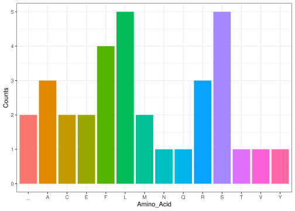

molecbio
================

# Installation

``` r
library(molecbio)
```

# Overview

The package **`molecbio`** consists of various functions intended to
replicate the central dogma of molecular biology and additional
functions to assist the management and visualization of the analysis.

# Implementation

### 1. **`dna_seq()`**

### 2. **`transcribe()`**

The **`transcribe()`** function performs transcription, which is the
process of converting a DNA sequence into an RNA sequence. In this
function, DNA thymine (T) nucleotides are replaced with RNA uracil (U)
nucleotides. It takes in a character string representing a DNA sequence
and impliments transcription on it to return the corresponding mRNA
sequence.

``` r

library(molecbio)

# Generate a random DNA sequence
DNA = dna_seq(10)

DNA
#> [1] "GTATACGAAC"

# Transcribe the DNA to mRNA
mRNA = transcribe(DNA)
mRNA
#> [1] "GUAUACGAAC"
```

### 3. **`sequence_to_codon()`**

### 4. **`translate()`**
The **'translate()'** function translates a provided codon sequence 
(input)into its corresponding amino acid code (output). This translation is performed 
in accordance with a pre-defined codon table that specifies the 
biological codon-amino acid matches.

``` r
library(molecbio)

# Define a codon sequence
codons <- c("UUACCAAGG")

# Translate codons into their corresponding amino acid codes
translate(codons)
#> [1] "LPR"

```

### 5. **`amino_acid_plot()`**

The **`amino_acid_plot()`** creates a column plot that visualizes the
frequency of occurrence of each unique amino acid in a given peptide
sequence.

``` r

library(molecbio)

# Create a peptide sequence
sample_peptide <- "MGKTGKEKSIEEILVIEQIESDNL"

# Create the column plot
col_plot <- amino_acid_plot(sample_peptide)
col_plot
```

<!-- --> \# Usage The
five functions together helps us replicate the entire process of
transcription and further analyze the results in a hastle free way as
shown below:

``` r

library(molecbio)

# Generate a random DNA sequence of length 100
DNA = dna_seq(100)

# Convert it to mRNA
RNA = transcribe(DNA)

# Convert the mRNA to codon sequence
Codon = sequence_to_codon(RNA)

# Translate the codon sequence to peptide sequence
Peptide_Sequence = translate(Codon)

# Create a column plot for the unique amino acids present
Col_plot = amino_acid_plot(Peptide_Sequence)

Col_plot
```

<!-- -->
